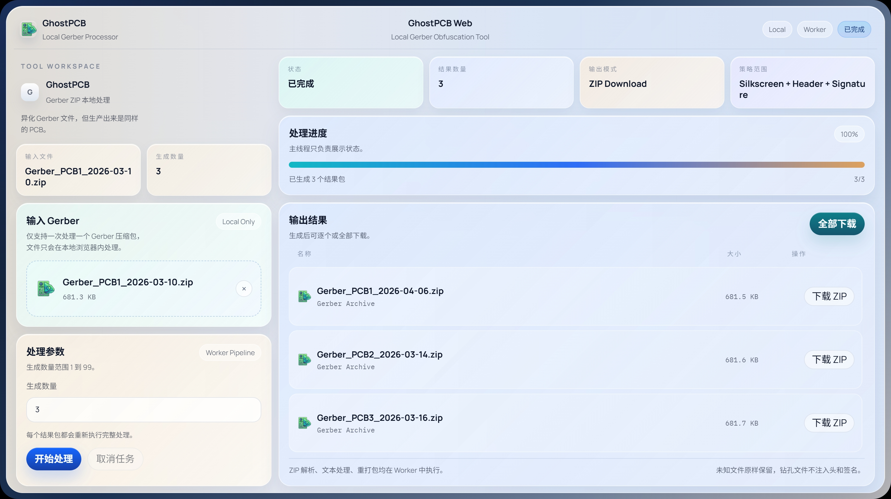

# GhostPCB Web

一个 Gerber ZIP 文件指纹混淆工具的纯前端 Web 版。异化 Gerber 文件，但生产出来是同样的 PCB。



## 技术栈

- 前端：React 19 + TypeScript + Vite
- 处理线程：Web Worker
- ZIP 处理：fflate
- 核心处理：TypeScript 实现 Gerber ZIP 解包、文本处理与重打包

## 使用方法

1. 选择或拖拽一个 Gerber ZIP 文件
2. 设置生成数量
3. 点击“开始处理”
4. 下载生成后的结果 ZIP

当前版本只支持一次处理一个 Gerber ZIP，所有文件都在浏览器本地处理，不上传服务器。

## 当前能力

- 支持单个 `.zip` Gerber 压缩包输入
- 支持生成 `1-99` 个输出结果
- 丝印层统一轻微平移
- 非 EasyEDA 文件头注入
- 非钻孔文件 LCEDA 风格签名注入
- 未知文件原样保留
- 钻孔文件不做头注入、不做签名注入、不做扰动

输出文件命名格式：

- `Gerber_PCB{序号}_YYYY-MM-DD.zip`

## 部署

### Vercel 一键部署

点击上方按钮即可直接部署到 Vercel：

[](https://vercel.com/new/clone?repository-url=https://github.com/Nitmi/GhostPCB-Web&project-name=ghostpcb-web)

### 本地运行

```bash
# 安装依赖
pnpm install

# 开发模式
pnpm dev

# 构建
pnpm build

# 预览构建产物
pnpm preview
```

## 测试

```bash
# 运行单元测试和集成测试
pnpm test

# 代码检查
pnpm lint
```

当前已覆盖的关键点：

- 文件类型识别
- EasyEDA 来源检测
- 丝印层位移且不改 `I/J`
- LCEDA 风格签名注入
- ZIP 输入到多 ZIP 输出的集成链路

## 声明

此软件仅供个人学习使用，不可用于商业用途！严禁用于破解嘉立创免费打样的拆单检测！

## 特别鸣谢

- [zhang monday](https://github.com/zhangMonday)

## License

MIT
